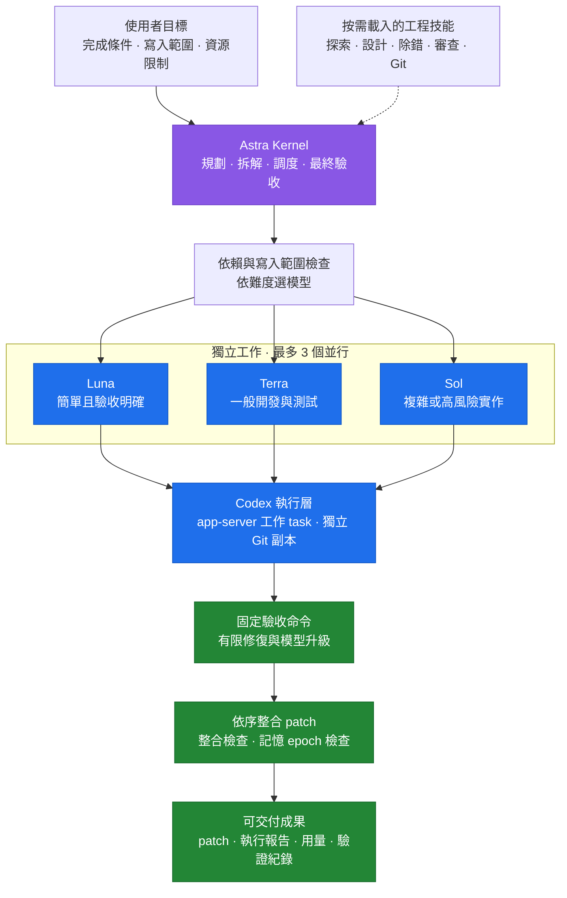
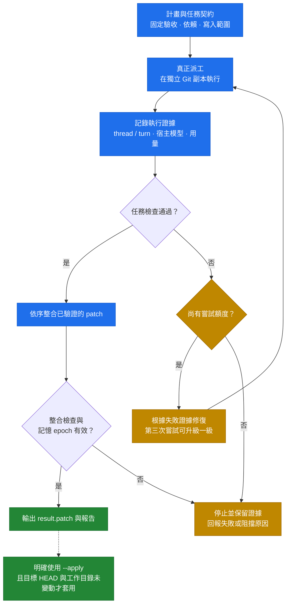
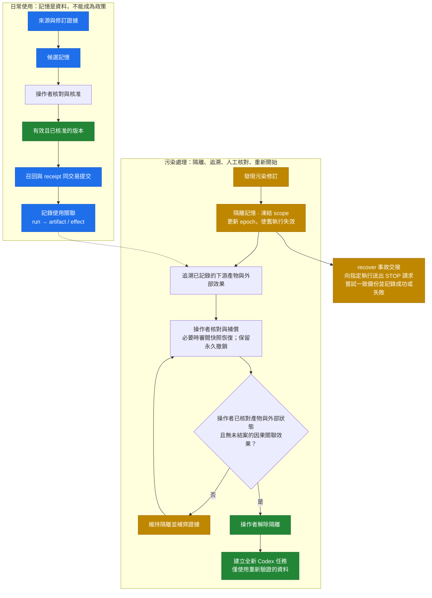

<div align="center">

# Serendipity — Epiphany · Codex

**多模型協作開發 · 可驗證的執行閉環 · 可追溯的記憶恢復**

Python 3.11+ · 標準庫實作 · MIT License

[快速開始](#立即驗證) · [模型分工](#開發任務如何分工) · [執行流程](#真正執行與目標-agent) · [記憶恢復](#記憶能做什麼) · [文件導覽](#文件導覽)

</div>

Codex 開發工具：可獨立使用的執行 harness，以及以模型決策驅動的目標 Agent。Astra 規劃，Sol / Terra / Luna 分工；附記憶准入、使用紀錄、污染隔離與恢復工具。Python 3.11+，只用標準庫。

這是從原 Serendipity — Epiphany 的工作流與記憶治理設計改編的獨立 Codex 版本，保留 MIT 授權。來源專案沒有被覆寫。參考取捨見 [現況分析](docs/INSPECTION.md) 與 [實作規格](docs/IMPLEMENTATION_PLAN.md)。

## 架構總覽

核心負責理解目標與整合成果；worker 依難度分工。只有依賴已完成、寫入範圍不衝突的工作會並行，最多同時 3 個 worker。



| 使用方式 | 誰決定下一步 | 如何判定完成 |
|---|---|---|
| `se.py run` — 執行 harness | 預先定義的任務與依賴 | 固定任務檢查與整合檢查 |
| `se.py agent` — 目標 Agent | Kernel 根據目標與觀察結果決定派工 | 仍須通過使用者指定的固定驗收 |

圖中的 Astra 是指定核心模型；啟動前須以 `doctor --live` 確認宿主實際可用模型。模型配置不代表該主機已具備對應能力。

---

## 立即驗證

在此專案根目錄開啟終端機：

```powershell
# Windows PowerShell / PowerShell 7；需要 Python 3.11+、Git、Codex CLI
python se.py doctor
python se.py plan --json examples/tasks.json
python se.py demo
python se.py test
python se.py doctor --live
python se.py safety-probe
```

`plan` 回傳模型與不衝突的執行批次；`demo` 在暫存資料庫實際演練污染與恢復；`test` 執行回歸測試。以上指令均不呼叫推論模型、不使用付費 API。`doctor --live` 只讀本機 app-server 的能力清單；`safety-probe` 只操作拋棄式測試檔。

2026-09-07 的本機結果：恢復演練通過，Windows 沙箱探測通過；CLI 0.147.0 的模型清單有 Sol/Terra/Luna，未列出 `gpt-6-astra`，專案 hooks 尚未受信任。`doctor --live` 因此會回傳 `ok:false` 與 exit 3，這是診斷結果。完整驗證及界線見 [EVALUATION.md](docs/EVALUATION.md)。

## 開發任務如何分工

| 工作 | 角色 | 模型 | 推理等級 |
|---|---|---|---|
| 核心調度、系統規劃、架構與最終整合 | kernel | `gpt-6-astra` | high |
| 複雜、高風險、高不確定性的工作 | sol | `gpt-5.6-sol` | high |
| 一般開發與測試 | terra | `gpt-5.6-terra` | medium |
| 簡單、低風險且驗收明確的工作 | luna | `gpt-5.6-luna` | low |

在 Codex 開啟此資料夾，使用 `$se-kernel` 並描述目標。核心先確認完成條件，再使用 Codex 原生子 Agent 派發獨立工作。每份工作包含目標、輸入、寫入範圍、依賴、驗證、停止條件；最多同時 3 個 worker。這些是目前任務的子 Agent，無需為每個小步驟建立使用者側欄任務。

原生配置在 `.codex/config.toml` 與 `.codex/agents/*.toml`。路由器從這些檔案讀模型，不重複維護另一份模型清單。`plan` 只規劃；v0.2 的 `run` 真正啟動 Codex app-server 工作 task，`agent` 則由模型觀察目標、自行決定派工並接收驗證結果。兩者都留下 thread/turn ID、宿主模型資料、用量和整合 patch，詳見 [執行操作](docs/EXECUTION.md)。

若模型缺少、使用量耗盡或推理等級不支援，應回報實際限制。更改模型是明確的設定修改，沒有自動猜測 alias 或偷偷降級。已知需求不足、寫入範圍重疊、依賴循環等會在派工前被拒絕。

## 真正執行與目標 Agent



```powershell
# Windows PowerShell；目標須為乾淨且已提交的 Git 專案，以下命令會使用模型用量
python se.py run --project C:/work/my-project --json C:/work/task.json
python se.py agent --project C:/work/my-project --json C:/work/goal.json
```

每個 worker 使用獨立 Git 副本；有依賴的工作等候上游完成，驗證成功的 patch 依序整合，再執行整合檢查。最多三次嘗試，第三次可升級一級；驗收由外層固定 argv 檢查。預設只產生已驗證 patch，加 `--apply` 才套回未變動的目標。模型說「完成」不會跳過檢查。

固定驗收命令在本機執行，必須由操作者信任。STOP、權限拒絕、失效的記憶 epoch 等阻擋不會被一般修復重試繞過；用量依宿主回報追蹤，並非硬性帳單上限。

八個技能保持按需載入：kernel、memory、recover，加上需求探索、系統設計、除錯、雙軸審查和 Git 工作流。Kernel 只拿短索引，需要時才讀細節。

相同真實任務的對照入口是 `python se.py benchmark --json examples/benchmark.json`。它使用固定 commit、固定驗收、相同模型／effort 比較流程，再固定流程／effort 比較模型；詳見 [評測設計](docs/BENCHMARK.md)。測試通過和評測結果必須分開解讀。

已完成一次真實目標 Agent 執行，以及兩項專案任務的模型／流程試跑。結果與發現的缺陷見 [v0.2 實測報告](docs/PILOT_RESULTS.md)；現有小樣本沒有證明整體效率勝過原版。

2026-09-22 的 v0.3 補強：新增 `recover` 事故處理入口、未確認外部效果的解封限制、隔離期間的可追蹤補償，以及跨 kernel/worker 的 epoch 檢查。設計、圖片五層防護的落實方式與驗證界線見 [v0.3 迭代紀錄](docs/ITERATION_V03.md)。本機最新能力查詢仍未列 Astra；保留指定核心模型並回報阻擋，不自動降級。

## 記憶能做什麼



記憶是有來源的資料，不能修改系統指令、模型、權限或驗收條件。外部文件即使獲准成為事實，也保留 external 來源。STOP 是停止請求，必須另行確認執行已停止；備份與隔離也不會清除既有模型上下文。

- Worker MCP 只能提出候選、召回已核准版本、記錄使用與產物、要求隔離。
- 操作者 CLI 才能核准、永久撤銷、撤銷准入政策、恢復與解除隔離。
- 召回先提交 receipt 才回傳內容；儲存失敗不回傳記憶。
- 污染會沿已記錄的依賴鏈標記下游，並讓舊 epoch 的執行失效。
- 快照只在原資料庫與安全日誌仍存在時使用；永久撤銷不會被舊快照覆蓋。
- 外部操作有 planned / applied / uncertain 等紀錄，補償必須有對應結果與操作者證據。工具不假裝能收回已寄出的信或自動恢復所有外部系統。

完整操作、每個 API 欄位與事故流程見 [記憶操作手冊](docs/MEMORY_RUNBOOK.md)。

已知污染修訂時，可用 `python se.py recover --db DATABASE --scope SCOPE --json REQUEST.json --run RUN_DIRECTORY`，一次隔離記憶、向指定且綁定相同記憶庫的執行寫入 STOP、嘗試產生一致 SQLite 備份，並保留事故交接檔。備份失敗會在報告中標示為不可用，不會自動解除隔離。此指令不呼叫模型、不覆蓋工作成果、不宣稱清除了既有模型上下文；完整可執行範例見操作手冊。

## 啟用方式與權限界線

一般 CLI 是 **governance 模式**。若 Agent 可以直接寫 SQLite、修改 broker 程式或執行操作者 CLI，就能繞過角色規則。短 prompt、關鍵字過濾、hooks 都不能取代權限隔離。

```powershell
# Windows PowerShell；只建立本專案的狀態目錄、產生可審閱設定
New-Item -ItemType Directory -Force .se-state | Out-Null
python se.py memory-config --db .se-state/memory.sqlite --scope project
```

產生器輸出有實際絕對路徑的 MCP 與 permissions 設定片段，不改全域設定。MCP 以固定 worker 權限啟動；沙箱拒絕直接讀寫狀態目錄，保護 `.codex`、skills 與 broker 程式。詳見手冊中的啟用步驟：先移除各載入層的舊 `sandbox_mode` 設定，再合併新設定並建立**新任務**。其他 MCP、瀏覽器、連接器與核准後的外部工具有獨立權限，必須另行限制。

目前已驗證的是拋棄式沙箱中的檔案邊界，並未替目前全權限任務切換權限。Hooks 的載入與信任狀態由 Codex 管理；請檢閱專案 hook 後在 Codex 的 hooks 介面明確信任。安裝工具不繞過信任機制。

## 安裝到另一個專案

```powershell
# Windows PowerShell；先將 $target 設為你要使用的現有 Git 專案
$target = Read-Host '目標 Git 專案的完整路徑'
python se.py install --target $target
python se.py install --target $target --apply
```

第一個指令只列計畫；第二個新增 `.codex` 原生角色、8 個 skills、精簡 `AGENTS.md` 與 `.se-codex` runtime/文件。已有檔案內容不同就整批停止，不覆寫、不自動合併。相同內容可重複安裝。沒有全域安裝、沒有依賴套件下載；遇既有 AGENTS/config 時，依 dry-run 清單逐項整合即可。

安裝後從目標根目錄執行 `python .se-codex/se.py demo`；診斷目標配置時加 `--project .`。解除安裝請依安裝結果的 created 清單審閱個別新增檔案；工具沒有提供會誤刪其他檔案的遞迴解除安裝。

## 專案結構

```text
Serendipity-Epiphany-Codex/
├── AGENTS.md                 # 精簡入口、交付與記憶邊界
├── se.py                     # CLI 入口
├── .codex/
│   ├── config.toml           # Codex 原生設定
│   └── agents/               # Astra / Sol / Terra / Luna 角色配置
├── .agents/skills/           # 8 個按需載入技能
├── src/se_codex/             # 調度、執行、記憶與恢復 runtime
├── tests/                   # 回歸與整合測試
├── examples/                # 任務、目標與評測契約範例
└── docs/                    # 操作手冊、設計與實測證據
```

## 文件導覽

| 想做什麼 | 閱讀文件 |
|---|---|
| 執行開發任務或啟動目標 Agent | [執行操作與契約](docs/EXECUTION.md) |
| 管理記憶、處理污染、確認恢復步驟 | [記憶操作手冊](docs/MEMORY_RUNBOOK.md) |
| 理解 v0.3 的安全補強與驗證範圍 | [v0.3 迭代紀錄](docs/ITERATION_V03.md) |
| 比較 harness 改善與模型差異 | [評測設計](docs/BENCHMARK.md) · [真實試跑結果](docs/PILOT_RESULTS.md) |
| 查看環境診斷與沙箱測試的限制 | [驗證紀錄](docs/EVALUATION.md) |
| 理解原版取捨與實作邊界 | [現況分析](docs/INSPECTION.md) · [實作規格](docs/IMPLEMENTATION_PLAN.md) |
| 規劃更通用的自主能力 | [AGI 導入構想](docs/AGI_ROADMAP.md) |

## 下一輪優先順序

若目標是往更通用、自主且能累積可靠經驗的 Agent 發展，見 [AGI 導入構想](docs/AGI_ROADMAP.md)。這是分階段設計提案；不將多模型與長期記憶直接宣稱為 AGI。

1. 在實際提供 Astra 且額度可用的主機，完成原生多模型任務驗收，記錄延遲、耗用量與返工率，再調整難度分級。
2. 在專用 worker 任務啟用生成的權限配置，驗證 MCP、其他工具與實際資料庫的整體邊界；高敏感環境改用獨立 OS 身分或受管 broker。
3. 為真正使用的外部工具接入 receipt 與補償介面。先接 Git/檔案工作流，再根據需求擴充。
4. 依實際召回品質決定是否需要語意檢索。現版採關鍵字檢索，不先加入向量資料庫。

不包含全域記憶匯入、既有聊天內容清洗、跨資料庫災難重建、自動部署或 GitHub 推送。這些都需要各自的資料與驗收條件。
