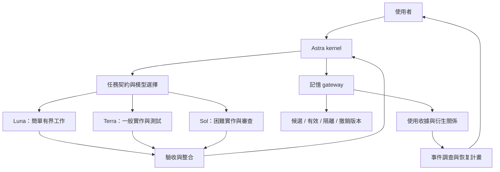

# Serendipity — Epiphany Codex：實作方案

日期：2026-09-07。這份文件保留最初的設計與驗收目標。使用者其後授權「全權交給你」並要求繼續完成，已實作本機版本；實際指令以 [README](../README.md) 與 [操作手冊](MEMORY_RUNBOOK.md) 為準，實測結果見 [EVALUATION](EVALUATION.md)。下方原設計的檔名/API 與 P3 完整保護目標不等於均已落地。

本輪落地：P1 原生角色、短 skills、路由器與分批派工契約；P2 SQLite gateway、固定 worker MCP、准入/receipt/追溯/隔離/恢復/效果紀錄；P3 hooks 診斷、權限設定產生器與 Windows 拋棄式沙箱探測；P4 不覆寫的專案安裝器。使用 Python 標準庫，沒有加入 Web UI、向量庫、Docker 或 CI。

與原規格的明確差異：快照限定原 store 與安全日誌，不做跨 DB 災難重建；外部補償紀錄與人工核對可用，但不替未接入工具自動執行；本機 Astra 清單缺項、hooks 尚未受信任，完整原生多模型推論與實際 worker 的全工具隔離仍待環境驗收。這些限制不會被報成通過。

## 1. PRD：目標、使用者與完成條件

為使用 Codex Desktop / CLI 的開發者提供可重用的開發 Agent：Astra 負責 kernel、系統規劃與調度；依工作難度派 Sol、Terra、Luna 並行處理獨立子任務，並提供可追溯、可撤回、可復原的專案記憶。

核心情境：

1. 開發者提出功能或 bug；kernel 定義完成條件與範圍，派工，驗證，修正後交付。
2. 常规工作使用較低模型等級；困難、敏感或跨模組工作提高等級，記錄升級理由。
3. 外部文件與過往教訓进入記憶時先隔離為候選；可信來源與驗證過程可追溯。
4. 一則記憶被發現錯誤後，能找出接觸它的任務與成果，停止後續傳播，從可信狀態重新工作。

首版完整完成條件：原生模型分工可實際啟動；至少一個並行開發情境通過驗收；記憶污染演練涵蓋准入、召回、撤銷、下游影響、舊快照恢復；所有未被系統觀測的操作明確標成未知。

初期不包含：自製聊天 UI、向量庫、知識圖譜服務、無限制自我改寫、完整重寫原專案、Docker、CI/CD、正式部署。這些不影響上述主流程，不先引入。

## 2. 啟動前判斷與取捨

- 真問題：目前 Codex 入口並不提供 Codex 原生派工；記憶檢查只在 commit 前，且無完整使用紀錄。
- 最小解：使用 Codex 現有 skills / custom agents / hooks；只有必須確定執行的記憶與驗證邏輯才写 Python 標準庫程式。
- 相容性：新版本只寫入目前目標工作區。來源專案保持原樣；保留來源授權與改編說明。全域 Codex 設定、既有任務與使用者記憶不在移植寫入範圍。
- 採納圖片中的短指令、按需載入、清楚完成條件與停止點；不把圖片中的產品架構或作者歸屬當已驗證事實。

## 3. SA：資料與操作流程

```text
使用者需求
  → kernel：確認目標 / 成功條件 / 授權邊界
  → 任務契約：依賴、寫入範圍、模型、驗收
  → 只給本次所需的可信指令與有來源的資料
  → Sol / Terra / Luna 子 Agent
  → 產物 + 變更範圍 + 可重現驗證證據
  → kernel 整合 / 必要審查 / 驗收
  → 成果；值得保存的經驗先成為記憶候選
```

資料所有權：使用者擁有需求與授權；kernel 擁有派工決策；worker 擁有被指派的修改範圍；memory gateway 管版本、准入、檢索與撤銷；人類操作者持有隔離解除與敏感恢復權限。

三種資料保持分離：

- **指令與政策**：精簡 AGENTS / agent config / 已審閱 skills；正常 worker 不自我改寫。
- **記憶資料**：來源、事實、證據、適用範圍、失效條件；不自動升級為指令。
- **執行證據**：task ID、模型、memory revision、測試、成果版本；不保存隱藏推理內容。

## 4. SD：最小架構



Codex 負責實際模型調用與子任務生命週期，repo 不假裝能直接呼叫只存在於此聊天環境的 `collaboration` 或 `mcp__codex_app` 工具。日後若需要獨立自動調度，另用已核對的 App Server 介面，不寫 UI 私有端點。

新 context 只隔離對話；worktree 只隔離修改；OS 身分、sandbox 與可用工具決定真正存取權。三者不可互相替代。

## 5. 模型路由與並行策略

| 角色 / 難度 | 模型 | 起始 reasoning | 典型工作 |
|---|---|---|---|
| kernel、系統設計、核心調度、重大衝突裁決 | `gpt-6-astra` | high；最困難再提高至宿主支援等級 | PRD / SA / SD、任務切分、安全邊界、方向判斷 |
| 高難度 | `gpt-5.6-sol` | high | 跨模組修改、棘手 debug、記憶與恢復邏輯、安全審查 |
| 一般 | `gpt-5.6-terra` | medium | 有清楚規格的實作、測試、常規分析 |
| 簡單 | `gpt-5.6-luna` | low / medium | 搜尋、盤點、格式整理、明確且可機械驗證的小改 |

Luna 可以處理低風險小改，不因模型較小一律禁寫；但涉及權限、秘密、資料刪除、恢復或規則修改時至少由 Sol 處理，重大決策回 kernel。

路由考慮四件事：需求歧義、相依跨度、錯誤影響、驗證難度。不能只看 prompt 長度、檔案數或關鍵字。

```text
若是 kernel / 架構 / 重大裁決 → Astra
否則若高風險、跨模組、難重現 → Sol
否則若目標明確、影響小且驗證簡單 → Luna
其餘 → Terra
派工前核對宿主是否支援 model + reasoning
```

執行契約：

- 顯式設定子 Agent model 和 reasoning，預設子模型 Terra，避免意外全部繼承 Astra。
- 記錄 requested model、host 回報的實際配置、選擇理由、重試與驗收結果；沒有實際資訊就寫 unknown。
- 同一失敗第一次依證據修正；第二次仍失敗時停止同一路徑，由 kernel 回報根因與選項。升級模型不重設失敗計數，不偷偷延長工作。
- 缺模型或額度不足時回報可用選項，不靜默全部升 Astra。價格、餘額未知就不產生虛構成本。
- 初始上限：3 個子任務並行，符合目前宿主容量；不為了填滿名額而派工。先並行唯讀與不相交的工作；共享 schema、lockfile、Git 寫操作序列化。
- 每個有寫入的子任務列出 write scope，輸出後檢查 diff；scope 宣告是協作約束，除非搭配 filesystem policy，否則不是安全隔離。
- 每次 brief 提供目標、必要輸入、scope、依賴、驗收、停止條件、輸出格式及 memory receipts。未相關的整段對話不隨便繼承。
- 一般延續可以使用原子任務；污染事件、失效上下文或需要改模型時使用新的乾淨 brief，且遵守當前宿主的 history-fork 限制。

## 6. Skills 與常駐指令

首輪能力收斂成三個入口：

1. `se-kernel`：規劃、難度分流、派工、驗收；debug、review、handoff 細節按需進 references。
2. `se-memory`：記錄候選、檢索、驗證、失效；實際資料操作經 gateway。
3. `se-recover`：發現污染時的隔離、影響報告、恢復與演練。

根 AGENTS 只保留需求邊界、任務所有權、驗證原則、模型分工入口、記憶不能改政策。PRD / SA / SD、ML、資料庫、部署等詳細工作流不全部常駐。

同一資訊保持一個來源：model 在 agent config，流程在對應 skill，狀態在資料庫。README 不再人工維護容易過時的能力數量。

## 7. 記憶資料結構

先用 Python `sqlite3`，不增加 ORM、向量資料庫或 LLM 框架。索引為可重建資料；精確來源與使用記錄不可由相似度推斷。

| 資料 | 最小欄位與責任 |
|---|---|
| source receipt | source_id、scope、來源種類、locator、來源版本/hash、取得時間；由入口記錄，不能由 worker 自證可信 |
| memory revision | memory_id、revision、內容/hash、source_id、適用範圍、失效時間/條件、policy_version、state |
| run receipt | run_id、thread_id、model、effort、狀態、memory_epoch、開始/完成時間 |
| recall receipt | run_id、memory_id、revision、實際交付內容 hash、記錄時間；不默默漏寫 |
| artifact revision | artifact_id、檔案/commit/輸出定位、版本/hash、producing run、needs_review 狀態 |
| lineage edge | 精確 parent / child ID 與 revision、關係、run_id；區分 source_access、recalled、derived、produced，不推斷模型內部因果 |
| safety event | 遞增 seq、incident_id、對象版本、隔離/撤銷/重新審核、原因；恢復時保留 |
| effect receipt | effect_id、run_id、工具、目標、idempotency_key、外部 reference、狀態；僅涵蓋經受控介面的效果 |
| snapshot manifest | schema_version、event_seq、memory_epoch、payload hash、可信 policy 版本、建立時間 |

狀態：`candidate → active → superseded`；任何未撤銷版本可以 `quarantined`；`revoked` 是終止狀態。更正建立新 revision；解除隔離需要新的驗證事件，不能直接把錯誤版本改回有效。

來源種類與可信度不是同一欄：external 內容可在保留外部來源的前提下通過本地驗證，不能改標為 self-observed 來洗掉 lineage。active 表示符合當前准入政策，不保證內容永遠正確。

## 8. 准入、召回、容量與政策邊界

```text
外部資料 → source receipt → candidate
  → 檢查格式 / 來源 / scope / 敏感資料 / 本地證據
  → 驗證與准入事件 → active

召回請求 → 檢查事件凍結狀態與 scope
  → 只取目前有效、未過期、未隔離、未撤銷版本
  → 在同一交易內寫 recall receipt
  → 提交成功才提供帶來源的記憶資料
```

- 決定性的准入門檻不能用模型自行填的 `validated: yes` 代替證據。
- 不可信資料不插入 developer 指令；記憶不能修改模型、權限、工具白名單或驗收標準。結構化與隔離能降低 prompt injection 風險，不能完全消除。依據：[OpenAI agent safety](https://developers.openai.com/api/docs/guides/agent-builder-safety)。
- 召回先記錄後交付；DB 失效時拒用記憶，可以明確轉入「無記憶工作」，不能假裝成功載入。
- 召回筆數、總字元量、候選/有效容量可配置；達上限停止新增或要求整理，不靜默刪除安全事件。初始建議每次最多 3 則，總長度由測試決定。
- checksum 驗證內容是否變動；TTL / anchors 發現可能過期；它們都不能判斷內容真假。
- 政策檔、skill、AGENTS 的修改與一般 memory activation 分開；需要產生可審查 diff 與回歸證據，不自動把記憶寫回常駐指令。
- 索引摘要仍是資料，可能含攻擊文字；縮短摘要不會使它自動可信。

## 9. 記憶已被使用：實際事件處置

### 9.1 立即止血與保全

1. 暫停受影響工作與記憶寫入/召回；中止受影響 Agent，另外盤查仍在執行的 shell / background job，不能假設結束 Agent 就取消外部動作。
2. 保全當前版本、收據、policy hash、成果 diff 與 incident ID。只存必要且可分享的證據，秘密不寫入一般 log。
3. 若新系統尚未安裝：由操作者先停止舊工作，以唯讀方式記錄 Git status / log、對照可疑 Lesson 的引用與未提交變更；沒有 receipts 的影響範圍標為未知，擴大人工檢查。

### 9.2 撤銷與影響範圍

在資料庫交易內寫入撤銷事件並提高 memory_epoch；未完成閉包計算前凍結該 scope 召回。記錄來源進入 context 的 source_access，即使它尚未寫成 memory 也納入調查。依 `source → run`、`memory → run → artifact → run → memory` 等已記錄邊，保守找出可能受影響的下游項目：

- 下游記憶先隔離。
- 接觸舊 epoch 的執行結果失去自動整合資格；不能把已取得污染資料的長任務當成乾淨任務。
- 成果標 `needs_review`，列出接觸路徑與證據。
- 外部效果列入事件報告；沒有紀錄或無法取得狀態時保留 unknown / uncertain。

接收 artifact、啟用 memory、建立 effect intent 時，在同一資料庫交易中檢查 run epoch 與 scope 最新 epoch 是否相等；不相等就拒絕。受控 dispatcher 在實際外部呼叫前再次檢查並記錄開始；檢查後已送出的外部請求仍可能與撤銷交錯，必須標成在途效果並查明結果，不能宣稱資料庫交易能撤回它。

報告區分「曾接觸、待檢查」與「已有產物/測試證據需修正」，不把單純讀過說成確定採用。同時有安全來源與污染來源的成果仍需重驗，不能靠另一個 owner 自動洗白。圖只保證涵蓋經 gateway 記錄的路徑，不宣稱能推導所有未觀測行為。

### 9.3 恢復乾淨工作環境

1. 選擇經操作者確認的 policy / 程式基準與記憶快照；先匯入 staging，檢查 schema、hash 與差異。
2. 恢復開始時凍結 scope，重新讀取最新 event_seq / epoch；若和 restore-plan 基準不同，舊 plan 失效並重算。在與撤銷操作序列化的交易內合併內容，保留並套用**現在的撤銷事件**。安全事件 journal 不由快照覆蓋或倒退；被撤銷記憶與 policy 不得隨舊快照重新啟用。
3. 從有效內容重建索引；恢復失敗保持凍結，不能宣告成功。
4. 開全新 session，使用已核對指令、最少任務資料與有效記憶。不要 fork 或 resume 污染對話；compact 和刪記憶都不會清除已進入目前 context 的文字。
5. 在獨立分支/工作樹對成果做最小修正與驗證。保留使用者當前修改；不自動 reset、刪檔或覆蓋原工作區。
6. 重新驗證受影響成果，由操作者解除事件凍結，留下原因、證據與尚未處理項目。

### 9.4 外部動作與補償

Git、資料庫、郵件、部署與第三方工具各有不同恢復方式，不能稱作一筆跨系統原子回滾。

- 在受控工具呼叫前記錄 planned effect；完成記 applied 與外部 reference。
- 當機、timeout 或成功回應遺失時標 uncertain；先查詢實際外部狀態，不能盲目重送。
- 補償是新的操作，保留 `compensates` 關聯與冪等鍵。遠端不支援冪等且狀態不可查時，轉人工處理。
- 已推送/合併的程式可透過 corrective commit / revert 修正；已被下游使用的效果不會因此消失。已寄出的訊息只能更正，不能當成未發生。
- 首版只產生補償計畫與狀態紀錄。實際外部寫入、正式部署、刪除或發訊息仍需該動作的使用者授權。

## 10. 安全保證的分級

**治理模式**：原生 Codex + skills + hooks + 本地 gateway。可提供正常操作路徑的版本、准入、使用紀錄、撤銷與恢復；如果 Agent 可直接改同一 DB / hooks / 檔案，仍能繞過。不得把它宣稱為抵抗同權限攻陷的安全沙箱。

**受保護模式**：gateway / DB / 撤銷紀錄放在 worker 不可直接讀寫的位置，使用不同 OS 身分或等效受控服務；原始未核准內容不掛入 worker 可讀空間，只暴露最小讀取/候選提交介面。政策修改、啟用與恢復使用另一個操作者權限。以實際拒絕 DB 直寫/越權讀取的測試驗證。

此模式必須實際滿足：DB / journal 的 OS ACL、每個 IPC/API 方法的角色與 scope 驗證、worker 不持有管理憑證且不能啟動高權限 helper。原始資料擷取在獨立低權限 context/process；已讀過原文的 ingestion worker 不能只因候選已隔離就被稱為乾淨。worker 若可直接呼叫外部寫入工具，該路徑不在 gateway 的 epoch 保護範圍。

Hook 做預檢與診斷，並確認 trust 與有效性；不能靠未信任 hook 或預設 fail-open 路徑阻擋風險。讀寫 gateway 的核心交易才負責拒用判定。[Codex hooks 的工具覆蓋限制](https://learn.chatgpt.com/docs/hooks)。

獨立審查 Agent 只增加第二意見。如果它繼承相同污染資料或持有相同權限，不能取代上述隔離。若連使用者帳號/OS 都被攻陷，需要從外部可信環境恢復，超出本工具的本地保證。

## 11. 分階段實作與檔案範圍

每階段先完成小功能與有效驗證，再進下一段；不用一次建立所有資料夾。

| 階段 | 可驗收成果 | 模型分工 | 預計檔案 |
|---|---|---|---|
| P1：原生開發流程 | 原生 roles 載入、模型分工、短 kernel、派工契約與一個真實並行情境 | Astra 定邊界；Terra 設定/文件；Luna 盤點/一致性；Sol 審查 | AGENTS.md、README.md、LICENSE、.gitignore、.codex/config.toml、3 個 agent TOML、se-kernel skill 與必要 references、tests/test_config.py |
| P2a：記憶准入與拒用 | source / revision / recall、准入、scope、隔離、撤銷與交易式召回收據 | Sol 核心邏輯；Terra CLI/測試；Astra 定案；不同檔案才並行寫 | src/se_codex/memory.py、src/se_codex/cli.py、src/se_codex/__main__.py、必要 __init__.py、tests/test_memory.py、se-memory skill、docs/MEMORY_RUNBOOK.md |
| P2b：追蹤與恢復 | run / artifact lineage、影響閉包、快照 staging、恢復演練與 effects 狀態 | Sol 恢復邏輯；Terra 驗收案例；Astra 檢查一致性 | 延伸 P2a 模組、tests/test_recovery.py、se-recover skill、更新 docs/MEMORY_RUNBOOK.md |
| P3：驗證與受保護模式 | hooks 真實觸發/拒用、權限隔離、污染 session 重建、模型路由品質比較 | Sol 權限/事件審查；Terra 整合；Luna 驗證報告；Astra 評估風險，使用者決定是否接受 | .codex/hooks.json、src/se_codex/hooks.py、tests/test_hooks.py、eval cases、docs/EVALUATION.md；隔離配置依本機可行性再定 |
| P4：可重用交付 | MVP 穩定後封裝與安全安裝/卸載，可安裝到另一個測試專案 | Terra 封裝；Luna 檢查；Sol 安裝邊界審查 | 視需求加入 .codex-plugin/plugin.json 或明確的專案安裝工具，不同時維護兩套技能來源 |

目標結構：

```text
Serendipity — Epiphany-codex/
├── AGENTS.md
├── README.md
├── LICENSE
├── .gitignore
├── .codex/
│   ├── config.toml
│   ├── agents/{sol,terra,luna}.toml
│   └── hooks.json                    # P3
├── .agents/skills/
│   ├── se-kernel/SKILL.md
│   ├── se-kernel/references/
│   ├── se-memory/SKILL.md             # P2
│   └── se-recover/SKILL.md            # P2
├── src/se_codex/                      # P2 起
├── tests/
└── docs/
    ├── INSPECTION.md                  # 本輪產出
    ├── IMPLEMENTATION_PLAN.md         # 本輪產出
    ├── MEMORY_RUNBOOK.md              # P2
    └── EVALUATION.md                  # P3
```

記憶 DB、收據、快照為 runtime 資料，位置透過設定提供且不提交 Git；受保護模式的儲存不位於 worker 工作區。CLI 設定避免硬編碼本機絕對路徑。

Git：實作前重新檢查目標；在目標建立 `feature/codex-agent-mvp`，保留原來源 HEAD 作改編依據。沒有授權不推送或合併 main。回滾採新工作區中的小提交/修正提交；不使用破壞性清理原來源。

## 12. CLI / 內部 API 契約

MVP 不開 HTTP server。以下為待實作的 CLI / 函式接口，不能現在直接執行。

| 操作 | 輸入 | 輸出 | 驗證 / 權限 |
|---|---|---|---|
| `memory propose` | scope、來源 locator/version、內容 | candidate ID/revision | 大小、格式、必要來源、路徑邊界；worker 可提案 |
| `memory activate` | 精確 revision、驗證證據、policy version | activation event | 操作者/受控角色；不能自己填 trusted 便通過 |
| `memory recall` | run_id、scope、query、limit | memories + receipt IDs + epoch | 只回有效版本；receipt 寫入失敗則 error |
| `memory quarantine` | revision、incident reason | incident ID、影響範圍 | 凍結受影響 scope；冪等 |
| `memory revoke` | revision、事件 ID | tombstone + impact report | 撤銷不可反轉；保留內容與證據 |
| `memory snapshot` | scope | manifest、可信內容版本 | 一致性匯出；排除秘密 |
| `memory restore-plan` | snapshot ID | staging 驗證與差異報告 | 不覆蓋現庫、不改工作樹 |
| `memory restore` | 已審查 plan ID | 恢復收據、剩餘隔離項目 | 操作者執行；重播現有撤銷事件 |
| `incident report` | incident ID | 接觸路徑、受影響成果、effects、unknown | 不宣稱未記錄操作都安全 |

共通成功格式：`{ok: true, data: ...}`；錯誤格式：`{ok: false, error: {code, message}}`，不包含秘密。建議 exit codes：0 成功、2 輸入錯誤、3 政策拒絕、4 儲存或一致性故障。CLI 的退出碼與 Codex hook 的判定協定分開轉換，不能直接共用。

邊界：拒絕未知版本、跨 scope、重複 ID 衝突、失效 policy、損壞 snapshot、目錄穿越；相同冪等請求回既有結果。schema migration 不靜默清庫或降版。

## 13. Verify：驗收與失敗處置

以下是建置後的驗證規格，**目前尚未執行**。

P1：解析 TOML、檢查模型與 reasoning、確認 roles 與 skills 被實際發現；一個明確小改、一個一般功能、一個困難除錯、一個系統規劃使用預期模型層級。模型實際調用必須有宿主證據；配置文字或 fake runner 不算整合驗收。

P2 的必要案例：

1. 外部候選在未驗證時不能召回；通過本地驗證仍保留來源 lineage。
2. 治理模式驗證外部內容不被解析成 policy/config；受保護模式另驗證，注入內容要求修改權限/模型/政策時，實際 OS/API 權限拒絕未授權操作。
3. 無來源、跨 scope、過期、隔離與撤銷版本都被拒用。
4. recall receipt 寫入失敗時，沒有任何記憶內容被交付。
5. `memory A → run B → artifact C → run D → memory E` 的影響閉包完整；無關成果不被誤刪。
6. 撤銷與召回競爭時，成功交付的一定有收據；舊 epoch 的在途結果不能直接整合。
7. 索引含舊版本時，最後准入檢查仍拒絕已撤銷內容。
8. 恢復舊快照不復活已撤銷記憶或被撤銷政策；restore-plan 後新增撤銷事件使舊 plan 失效；損壞/新 schema 被拒絕。
9. 恢復中途失敗可重試，結果一致，保留事件凍結與操作證據。
10. uncertain 外部效果不盲目重送；補償有獨立紀錄，不宣稱撤銷已寄出的訊息。
11. 污染後啟動全新 context，確認未帶入污染對話與未核准記憶。
12. 受保護模式下，worker 直接讀取原始候選、修改 DB、修改撤銷紀錄或政策均被實際權限拒絕；治理模式則明示此項不具保證。

P3：新/變更 hook 未信任、timeout、JSON 格式錯、不同 tool payload、子 Agent 與非同步 shell 場景。確認健康檢查會顯示缺口，記憶保護不依賴 hook 一定執行。採用 mock 外部工具驗證補償，避免測試真的寄信、部署或刪正式資料。

預計測試命令（實作後，於目標根目錄）：

```powershell
# Windows / PowerShell
$env:PYTHONPATH = (Join-Path (Get-Location) 'src')
python -m unittest discover -s tests -v
```

預期：exit 0，所有驗收 tests 通過；失敗時查看具名測試、incident/run ID 與不含秘密的錯誤。測試資料使用暫存 SQLite、合成記憶、合成 Git repo 與 mock effects。

單元測試不涵蓋模型實際判斷、所有 prompt injection 或真實第三方服務。另行做小量真人任務 E2E：固定 CLI/model/輸入與驗收條件，記錄通過率、錯派/升級、時間、可取得的 token 用量及人工介入次數。比较精簡與原流程，不能把少數案例當通用效能結論。

## 14. 工作循環與停止邊界

`Inspect → Define Goal → Plan → Execute → Verify → Repair → Review Diff → Report`。

本輪已完成 Inspect 與具體 Plan，只新增兩份文件。P1 起每段使用小變更與相應驗證；不要每個小改都重新跑完整流程或增加紀錄檔。

完成每段檢查差異、暫存檔、無用 import 與文件一致性。未知用途檔案不刪；使用者原碼不刪。測試 fixtures / temp DB 留在暫存區，不混入產品。

需要停止並交由使用者決定的情況：重大範圍變更、正式部署、推送 main、破壞性 Git/資料操作、新的付費服務或大規模模型評估、秘密暴露風險，以及同一路徑連續兩次修正無效。

一般可逆修正、唯讀查證、已核准階段內的必要驗證繼續做，不把每一步變成核准點。

下一步：確認 P1 範圍後實作原生開發流程；完成載入與派工驗證後，依 P2 / P3 補齊記憶治理與受保護模式。直到對應驗收通過前，不稱整個開發 Agent 已完成。
